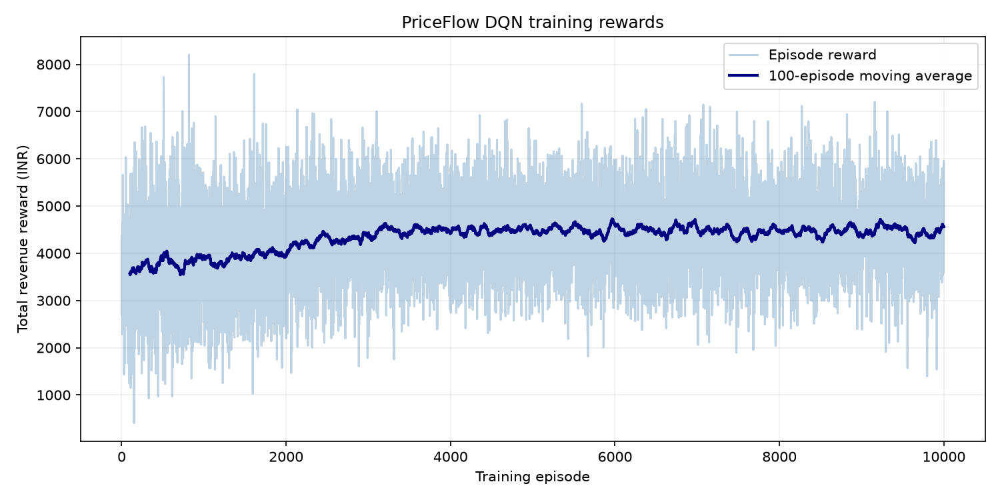
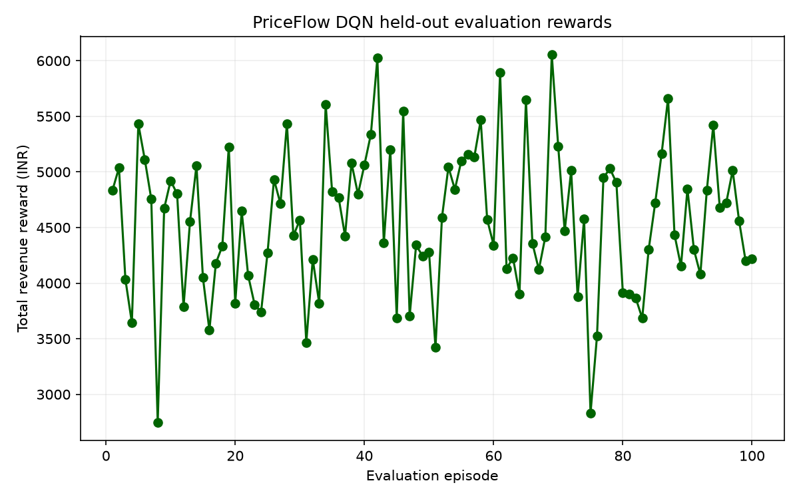
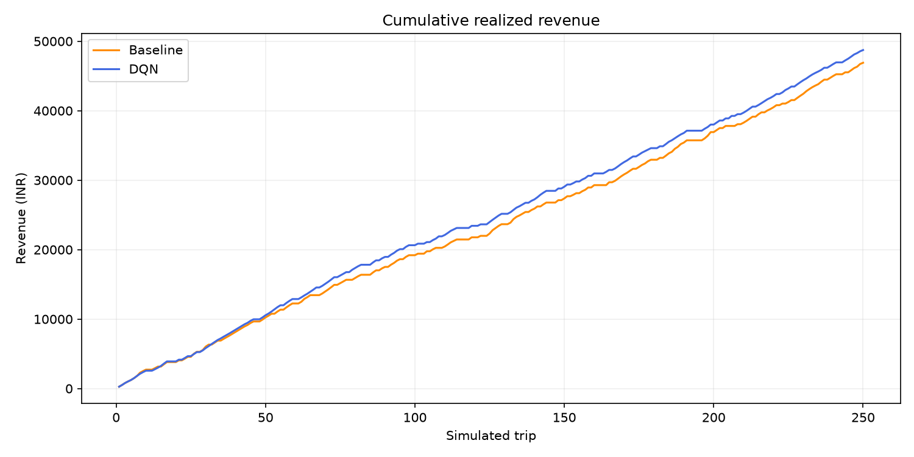
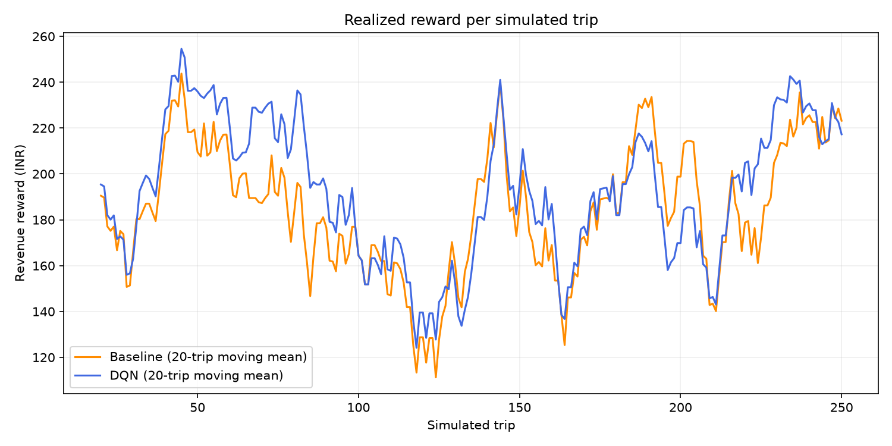
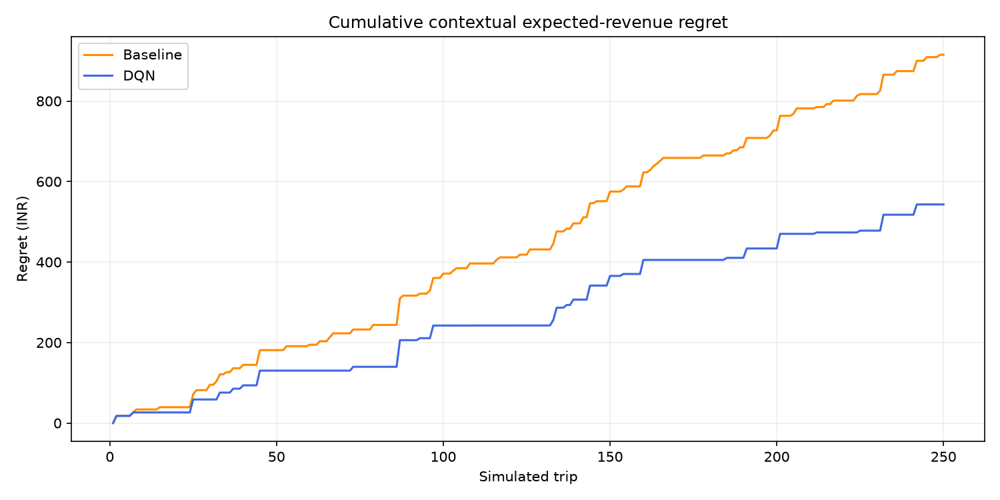

# PriceFlow — Dynamic Pricing Engine for Ride-Sharing

PriceFlow is a reinforcement-learning-based dynamic pricing engine for a simulated ride-sharing market in Pune, Maharashtra, India. It generates reproducible synthetic trips, trains a custom Gymnasium environment with a Stable-Baselines3 DQN agent, exposes pricing through FastAPI, stores pricing decisions in MongoDB when configured, and evaluates the agent against a fixed weather-based baseline.

## Project architecture

- `data/generate_data.py` builds a reproducible synthetic ride dataset of 500,000 rows.
- `environment/pricing_env.py` defines the custom Gymnasium environment.
- `training/train_agent.py` trains the DQN policy and saves artifacts to `models/` and `results/`.
- `api/` contains the FastAPI service, request models, and database integration.
- `evaluation/run_ab_test.py` compares baseline and RL policies using matched evaluation scenarios.
- `config.py` contains shared bounds, surge choices, paths, and episode settings.
- `results/` contains the recorded training/evaluation metrics and generated charts described below.

## Prerequisites

- Python 3.11 or newer (the recorded training and API verification used Python 3.14.6)
- Windows 10/11, macOS, or Linux
- A local MongoDB instance is optional for logging. The core pricing pipeline works without MongoDB.
- A virtual environment is recommended.

## Virtual environment setup on Windows

From the repository root:

```powershell
python -m venv venv
.\venv\Scripts\Activate.ps1
python -m pip install --upgrade pip
pip install -r requirements.txt
```

## Dependency installation

```powershell
pip install -r requirements.txt
```

Dependencies are declared in `requirements.txt`, including NumPy, Pandas, Gymnasium, Stable-Baselines3, PyTorch, FastAPI, Uvicorn, PyMongo, Matplotlib, and python-dotenv.

## Generate the synthetic trip dataset

Default dataset:

```powershell
python -m data.generate_data
```

Custom dataset:

```powershell
python -m data.generate_data --count 500000 --output data/rides_trips.csv --seed 42
```

The default output is `data/rides_trips.csv` and the script prints the record count, acceptance rate, total revenue, and file path. This dataset is for analysis and simulation only; it is not used as DQN training data.

## Dataset schema and assumptions

The generated dataset contains:

- `trip_id`
- `latitude`
- `longitude`
- `hour`
- `day_of_week`
- `weather`
- `demand`
- `supply`
- `base_price`
- `surge_multiplier`
- `acceptance_probability`
- `accepted`
- `revenue`

The generated CSV currently contains exactly 500,000 rows and these 13 columns. Its fixed seed makes regeneration reproducible. The synthetic geospatial coordinates approximate Pune bounding boxes for simulation and experimentation only; they are not real trip logs. The generated CSV is included as a reproducibility artifact and is about 38 MB.

## RL environment design

The custom environment is implemented in `environment/pricing_env.py` and subclasses `gymnasium.Env`. `gymnasium.utils.env_checker.check_env` passed during this readiness audit.

Observation space:

- normalized latitude and longitude
- cyclic (sine/cosine) hour encoding
- normalized day of week
- normalized weather code (`clear`, `cloudy`, or `rain`)
- normalized demand, supply, and base price

Action space:

- discrete surge choice from `1.0x, 1.25x, 1.5x, 1.75x, 2.0x, 2.25x, 2.5x, 2.75x, 3.0x`

Reward behavior:

- an accepted trip earns `base_price * surge_multiplier`; a rejected trip earns zero
- rider acceptance is sampled probabilistically, using the demand, supply, weather, and surge response assumptions in `data/generate_data.py`

Each step simulates a new trip using the synthetic generator's Pune coordinate bounds, weather probabilities, demand/supply distributions, and base-price distribution. Day of week is sampled independently, matching the generator. The default episode contains 24 trips.

Termination behavior:

- the configurable episode horizon ends naturally with `terminated=True`
- `truncated` remains false because the simulation has no external time limit

## DQN training and configuration

Training is configured in `training/train_agent.py`.

Example quick smoke test:

```powershell
python -m training.train_agent --episodes 2 --evaluation-episodes 5 --seed 42 --learning-starts 8 --batch-size 8
```

Full target run (10,000 episodes):

```powershell
python -m training.train_agent --full-target --seed 42
```

The script computes total timesteps with the environment's actual episode horizon:

- total_timesteps = episodes * episode_horizon
- if the environment horizon is 24, the full run uses approximately 240,000 timesteps

This is important because episodes and timesteps are not the same concept.

The trained model is saved to `models/dqn_pricing.zip`. The trainer evaluates the policy on separately seeded episodes and saves per-episode train/evaluation rewards, a JSON summary, and reward plots in `results/`. The committed summary and CSVs are measured outputs from the 10,000-episode run listed in [Verified run results](#verified-run-results).

Default DQN hyperparameters:

- Learning rate: `5e-4`
- Replay buffer: `50,000` transitions
- Batch size: `64`
- Discount factor (`gamma`): `0.99`
- Exploration: epsilon decays from `1.0` to `0.05` over 30% of training
- Target network update interval: every `1,000` environment steps
- Learning starts after `2,000` transitions; optimization runs every 4 steps

These parameters can be overridden through the corresponding command-line options. The short smoke command lowers `learning-starts` and `batch-size` so it performs gradient updates with only two training episodes.

## FastAPI pricing service

Start the app with:

```powershell
python -m uvicorn api.main:app --host 127.0.0.1 --port 8000
```

Example request:

```json
{
  "lat": 18.5204,
  "lng": 73.8567,
  "hour": 18,
  "day_of_week": 4,
  "weather": "rain",
  "demand": 80,
  "supply": 45,
  "base_price": 150.0
}
```

PowerShell request:

```powershell
$body = @{
  lat = 18.5204
  lng = 73.8567
  hour = 18
  day_of_week = 4
  weather = "rain"
  demand = 80
  supply = 45
  base_price = 150.0
} | ConvertTo-Json
Invoke-RestMethod -Method Post -Uri http://127.0.0.1:8000/price -ContentType "application/json" -Body $body
```

One actual local response from the audit (latency values vary between requests):

```json
{
  "surge_multiplier": 1.0,
  "base_price": 150.0,
  "final_price": 150.0,
  "estimated_acceptance_probability": 0.5060571428571428,
  "model_identifier": "dqn_pricing.zip",
  "metadata": {
    "weather": "rain",
    "hour": 18,
    "day_of_week": 4,
    "demand": 80.0,
    "supply": 45.0
  },
  "inference_latency_ms": 0.5761,
  "database_latency_ms": 57.3056,
  "logged_to_mongodb": true
}
```

The API validates coordinates, hour, day, weather, demand, supply, and base price; invalid input returns 422. A missing or incompatible trained model returns 503. `inference_latency_ms` measures DQN prediction and `database_latency_ms` measures the MongoDB insert separately. `logged_to_mongodb` becomes true only when insertion succeeds.

Health check:

```powershell
Invoke-RestMethod -Method Get -Uri http://127.0.0.1:8000/health
```

The response reports `model_loaded` and the live `database_connected` status independently. A valid price response includes `surge_multiplier`, `base_price`, `final_price`, `estimated_acceptance_probability`, `model_identifier`, `inference_latency_ms`, `database_latency_ms`, and `logged_to_mongodb`.

When MongoDB is reachable, each request and pricing decision is inserted into the `pricing_logs` collection. Configure `MONGODB_URI` and `MONGODB_DATABASE` in the local, git-ignored `.env` file; use the Atlas SRV connection string copied from your Atlas cluster settings. Do not put credentials in `.env.example` or commit `.env`. If MongoDB is unavailable, the pricing response still succeeds and reports `logged_to_mongodb: false`.

## MongoDB configuration

MongoDB logging is optional. The root `api/database.py` loads the project-root `.env` file explicitly. Start with the safe placeholders in `.env.example`:

```env
MONGODB_URI=mongodb+srv://<database-user>:<url-encoded-password>@<cluster-host>/priceflow?retryWrites=true&w=majority
MONGODB_DATABASE=priceflow
```

Copy the template and privately replace its placeholders with your MongoDB connection details before starting the API:

```powershell
copy .env.example .env
```

Use an Atlas URI copied from Atlas or a local MongoDB URI. URL-encode reserved characters in the database user's password (for example, `@` as `%40`). Never paste credentials into source control or chat. `.env` is git-ignored; `.env.example` contains placeholders only. A MongoDB outage does not disable pricing: the API returns a valid quote and `logged_to_mongodb: false`. When connected, writes go to the `priceflow` database's `pricing_logs` collection.

For local MongoDB, one option is `docker run -d -p 27017:27017 --name priceflow-mongo mongo:7`.

## A/B evaluation and revenue-lift calculations

The baseline policy is:

- `1.5x` during rain
- `1.0x` during clear or cloudy weather

The evaluation runner compares both policies on identical, reproducible contextual trips sampled with the synthetic generator's distributions. Rider acceptance uses matched random draws and the same demand/supply/weather/surge response function as the environment. It reports total revenue, mean revenue per trip, acceptance rate, average surge multiplier, revenue lift, and cumulative expected-revenue regret.

```powershell
python -m evaluation.run_ab_test --scenario-count 250 --seed 42 --model models/dqn_pricing.zip --output-dir results
```

The script saves:

- `results/cumulative_revenue.png`
- `results/reward_comparison.png`
- `results/policy_regret.png`
- `results/ab_test_scenarios.csv`
- `results/ab_test_metrics.csv`
- `results/ab_test_metrics.json`

Revenue lift is computed as:

```text
(revenue_rl - revenue_baseline) / revenue_baseline * 100
```

If baseline revenue is zero, revenue lift is reported as undefined (`null`) and the 10% target is not marked as met.

Policy regret is computed against the best expected revenue among the nine configured surge actions for each scenario under the simulator. This contextual finite-action reference is not claimed to be a globally optimal policy or a real-world guarantee. The results explicitly indicate whether measured revenue improvement exceeds the 10% target.

## Verified run results

The following values are the actual persisted outputs from the 10,000-episode training run and the subsequent 250-scenario A/B run (seed 42). They are not projected or guaranteed results.

| Measure | Weather baseline | DQN |
| --- | ---: | ---: |
| Total realized revenue | INR 46,903.45 | INR 48,734.06 |
| Acceptance rate | 66.4% | 72.0% |
| Average surge multiplier | 1.09x | 1.00x |
| Mean revenue per scenario | INR 187.61 | INR 194.94 |

Measured DQN revenue lift was **3.90%**. The assignment's 10% target was **not met**. Evaluation used identical generated contexts and the same random acceptance draws for both policies. The baseline charges 1.5x in rain and 1.0x otherwise. Its regret comparison uses the best expected revenue among the nine available actions per context; this is a finite-action simulator benchmark, not a claim of global or real-world optimality.

Training completed 10,000 episodes / 240,000 timesteps (24 steps per episode). The training episode reward mean was INR 4,333.71 (standard deviation INR 894.11). On 100 separate seeded evaluation episodes, mean reward was INR 4,554.76 (standard deviation INR 650.37). See [`training_summary.json`](results/training_summary.json) and [`ab_test_metrics.json`](results/ab_test_metrics.json) for full-precision metrics.

### Saved plots











## API latency audit

Latency was measured against a locally started API using 32 sequential valid `POST /price` requests. The client-side stopwatch measured full HTTP round-trip time; the API response separately measured inference and MongoDB insert time. All 32 pricing records were reported persisted, and `/health` reported the model loaded and database connected.

| Measurement | Mean | p50 | p95 | Maximum |
| --- | ---: | ---: | ---: | ---: |
| End-to-end HTTP round trip | 73.684 ms | 55.083 ms | 141.078 ms | 247.496 ms |
| DQN inference (API-measured) | 0.703 ms | — | — | 2.547 ms |
| MongoDB insert (API-measured) | 66.754 ms | — | — | 241.950 ms |

The under-50-ms **end-to-end** target is not met in this measurement: p50 and mean exceed 50 ms. The DQN inference portion is below 50 ms; synchronous database persistence dominates measured request time. Results are specific to this local machine/network and the configured MongoDB path, not a general performance guarantee. To reduce response latency, benchmark the database region/network and connection pool first; if the assignment permits decoupled persistence, enqueue writes to a bounded background worker and return after pricing, with explicit queue health, retry, and durability handling. Do not silently drop database writes. A fast local cache or database placement closer to the API may also help.

## Known limitations and possible improvements

- The synthetic trip data is simulation-based and not sourced from real Pune trip logs.
- The reward and acceptance model are intentionally simplified approximations.
- The DQN is trained in a stylized environment and should be treated as a simulator-driven proof of concept.
- The recorded 3.90% revenue lift is below the 10% target and applies only to the one fixed-seed 250-scenario sample; broader holdout and statistical uncertainty analysis are needed before drawing conclusions.
- Real deployments would need feature engineering, offline validation, hidden test sets, operational safeguards, and live A/B monitoring.
- MongoDB persistence is optional and graceful-failure only; currently it runs synchronously and can dominate API latency.

## Git review and submission

This project already has a Git repository on branch `main` with an `origin` remote. Do not run `git init` or add a second remote. Before committing, review the working tree and stage only intended project files:

```powershell
git status --short --branch
git check-ignore -v .env venv .pytest_cache results/train_monitor.monitor.csv
git diff --cached --stat
git diff --cached --check
```

The ignore rules exclude `.env`, virtual environments, caches, IDE state, temporary files, and runtime logs. They allow the safe `.env.example`, trained model, dataset, training/evaluation metrics, and plots. Stage project source and intended artifacts explicitly rather than using `git add .`; then inspect the complete staged file list and diff:

```powershell
git add .gitignore .env.example README.md requirements.txt config.py
git add api environment evaluation training src
git add data/generate_data.py data/rides_trips.csv models/dqn_pricing.zip
git add results/.gitkeep results/training_summary.json results/training_episode_rewards.csv results/evaluation_episode_rewards.csv
git add results/ab_test_metrics.json results/ab_test_metrics.csv results/ab_test_scenarios.csv
git add results/reward_curve.png results/evaluation_rewards.png results/cumulative_revenue.png results/reward_comparison.png results/policy_regret.png
git status --short
git diff --cached --stat
git diff --cached --check
git diff --cached
```

Confirm `.env`, `venv/`, caches, and `results/train_monitor.monitor.csv` do not appear as staged files. Do not commit until the staged diff has been reviewed. To commit and push using the already configured `origin`:

```powershell
git commit -m "Submit PriceFlow dynamic pricing engine" -m "Co-authored-by: Copilot <223556219+Copilot@users.noreply.github.com>"
git push origin main
```

## Reproduce the assignment pipeline

Run from the project root in the activated virtual environment (or replace `python` with `.\venv\Scripts\python.exe`):

1. Regenerate the deterministic dataset:
   ```powershell
   python -m data.generate_data --count 500000 --seed 42
   ```
2. Run the 10,000-episode DQN training:
   ```powershell
   python -m training.train_agent --full-target --seed 42
   ```
3. Evaluate on 250 identical scenarios:
   ```powershell
   python -m evaluation.run_ab_test --scenario-count 250 --seed 42 --model models/dqn_pricing.zip --output-dir results
   ```
4. Start the API:
   ```powershell
   python -m uvicorn api.main:app --host 127.0.0.1 --port 8000
   ```

Check health and request a quote using the PowerShell example above. The actual checked request body uses a Pune coordinate within configured validation bounds.

To run a short development training session instead of the full target:

   ```powershell
   python -m training.train_agent --episodes 2 --evaluation-episodes 5 --seed 42 --learning-starts 8 --batch-size 8
   ```

## Final note

This repository demonstrates a complete RL-based pricing pipeline in a simulated environment. It is designed to be reproducible, testable, and easy to extend for more realistic pricing experiments.
